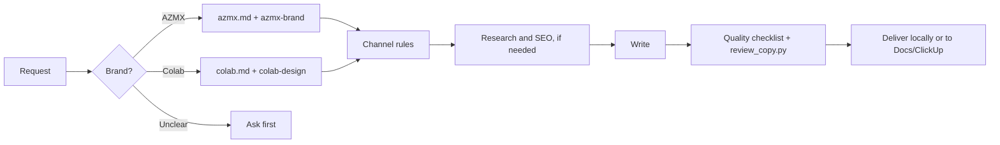

# Brand Content

A private agent skill for writing **AZMX** and **Colab** content in Arabic and English: articles, emails and website copy, from research to a designer-ready handoff. Works in Claude Code and Codex. Version **1.3.0**.

It gives the agent a disciplined content workflow: resolve the brand, load only the rules the task needs, write for a real reader, check facts and voice, then deliver without touching anything it was not asked to change.

## Quick start

**1. Install** (needs Node.js, Git and GitHub access to this private repository):

```bash
DISABLE_TELEMETRY=1 npx skills@1.5.25 add Gamaleldientarek/brand-content-kit --skill brand-content --agent codex claude-code --global
```

**2. Open a fresh agent session** so the skill is discovered.

**3. Ask for something:**

```text
/brand-content Write an AZMX article from this report, in Arabic and English, with a keyword plan and designer handoff.
```

```text
/brand-content اكتب إيميل لكولاب يدعو فريق المنتج لمراجعة سؤال البحث. أريد الموضوع والمتن فقط.
```

In Codex, use `$brand-content` instead of `/brand-content`. The skill also loads on its own when a request mentions AZMX or Colab content.

## What you get

| Channel | Deliverables |
|---|---|
| **Articles** | Angle and research brief, keyword cluster with provenance, Arabic and English editions, titles and SEO metadata, four-sentence Arabic designer summary, thumbnail and image briefs |
| **Emails** | Subject, preheader for newsletters, complete body, verified sign-off, one real next step. Drafts only; nothing is sent |
| **Website copy** | Page purpose, H1 and section copy in reading order, CTA labels, microcopy, SEO title, description and proposed slug |
| **Edits** | Focused review or adaptation of existing copy, preserving everything outside the request |
| **Handoff** | Optional Google Docs tabs and ClickUp card fields, read back and verified |

## How it works



The skill picks one of five modes so a small edit never triggers the full pipeline:

| Mode | Use it for |
|---|---|
| **Create** | New content through the channel workflow |
| **Review** | Fix the requested dimensions of existing copy |
| **Adapt** | Another audience, language or channel, same facts |
| **Resume** | Continue a partly finished card or document |
| **Handoff** | Move approved copy into Docs or ClickUp |

## Brands

| Brand | Voice | Profile | Linked brand skill |
|---|---|---|---|
| AZMX | Mid-formal, balanced, bold but respectful; a Saudi digital consultancy, never an agency | [azmx.md](skills/brand-content/references/azmx.md) | [`azmx-brand`](https://github.com/Gamaleldientarek/azmx-brand) |
| Colab | The empathetic analyst: rigorous in, simple out; evidence before opinion | [colab.md](skills/brand-content/references/colab.md) | [`colab-design`](https://github.com/Gamaleldientarek/colab-design) |

The profiles are traceable extracts of the brand skills, pinned by checksum in [brand-sources.json](skills/brand-content/references/brand-sources.json). When the full brand skill is installed, it wins. The two brands never share voice, palette or type. Majarah, Clix and Anatomi are not profiled; the skill asks before writing for them.

## Human voice

Every deliverable is written to read as the work of a careful human editor, in both languages. The [editorial rules](skills/brand-content/references/editorial.md) ban em-dashes, emojis in copy, “not just X, but Y” and «ليس مجرد... بل» reframes, stock vocabulary such as *leverage*, *seamlessly* and «يلعب دورًا محوريًا», mirrored paragraphs and summaries that restate their heading. Arabic numeric ranges use an ASCII hyphen, because an en dash can render them reversed.

The skill never promises that an AI detector will pass the text. Quality comes from specific claims, real evidence and varied rhythm.

## Defaults you can override

- Easy standard Arabic for Saudi readers; English names and technical terms kept in English.
- Long articles: 2,000–2,500 body words per edition. A shorter authored Blog Post when that fits better.
- Full article packages come in Arabic and English. Emails and pages use only the requested languages.
- Two images per article (cover and one explanatory image), three at most.
- ClickUp card description: Arabic summary, article link, Thumbnail Brief, Image Brief.
- Google Doc tabs: Arabic, English, SEO Plan, Thumbnail Brief, Image Brief, and Research & Review when useful.
- No automatic CTA, hashtags, publishing or sending.

Anything you say in the request overrides these.

## Helper scripts

Both are read-only. Run them from the installed skill directory.

```bash
python3 scripts/review_copy.py article.md --min-words 2000 --max-words 2500 --format text
```

```text
Estimated body words: 2140
- line 9: english_stock_phrase_review 'seamlessly'
- line 22: arabic_range_dash '25–34'
- line 31: arabic_ai_pattern_review 'في عالم اليوم'
```

`review_copy.py` estimates body words and flags em-dashes, Arabic range dashes, emojis, repeated sentence openers, encoding problems and AI-tell phrases in English and Arabic. Kinds ending in `_review` need judgment, since quotations can match. JSON is the default output.

```bash
python3 scripts/keyword_inventory.py inventory.xlsx --sheet Inventory --query "تجربة المستخدم"
```

`keyword_inventory.py` returns matching keyword rows with sheet and row provenance, keeping blanks as unknown rather than zero. CSV needs only the standard library; XLSX needs `openpyxl`.

Neither script validates facts, search demand, SEO success or authorship.

## Repository layout

```text
skills/brand-content/
  SKILL.md                    entrypoint: steps, routing table, defaults
  references/
    editorial.md              Arabic, English and human-voice rules
    azmx.md, colab.md         brand profiles
    articles.md, emails.md, websites.md
    research.md, seo.md, visual-briefs.md
    clickup-workflow.md, delivery.md
    quality-checklist.md      pre-delivery gate
    examples.md               tone and AI-tell calibration
    brand-sources.json        upstream provenance
  assets/                     handoff and research-plan structures
  scripts/                    review_copy.py, keyword_inventory.py
  agents/openai.yaml          Codex display metadata
tests/                        unit, package and install checks; behavioral cases
```

## Troubleshooting

| Problem | Fix |
|---|---|
| Skill does not appear | Start a new agent session. For Claude Code, check that `~/.claude/skills/brand-content` exists; for Codex, check its skills directory. |
| Install fails with a 404 or auth error | The repository is private. Run `gh auth login` or configure SSH, then retry. Never paste a token into the command. |
| Project install fails in a synced folder | Project-scoped installs can fail inside Google Drive or other cloud-synced folders. Use `--global`. |
| Output ignores the current brand guide | Install `azmx-brand` or `colab-design`. Without them the skill writes from its bundled profile and says so. |
| `keyword_inventory.py` rejects an `.xlsx` | Install `openpyxl` in an isolated environment, or export the sheet to CSV. |
| Docs or ClickUp handoff is skipped | The host has no authenticated connector. The skill finishes local work and reports what it could not deliver. |

## Integrations and privacy

The skill uses whatever authenticated tools the host exposes, discovered at runtime. It bundles no MCP server, credentials, client articles, keyword spreadsheets or workspace IDs, and the package tests fail if machine paths, document IDs or token patterns appear in it.

Keep task outputs outside the repository, for example in an ignored `private/` or `runs/` directory. Private GitHub access controls distribution; it does not make model-provider processing local. Installing or invoking the skill never authorizes sending email, changing workflow status or publishing.

## Development

```bash
python3 -m venv .venv && .venv/bin/pip install -r requirements-dev.txt
.venv/bin/python -m unittest discover -s tests -v
```

[GitHub Actions](https://github.com/Gamaleldientarek/brand-content-kit/actions/workflows/ci.yml) runs the unit and package tests on Python 3.11 and 3.13, then installs the skill with `skills@1.5.25` for Codex and Claude Code in copy and symlink modes. It uses read-only permissions, pinned actions and synthetic fixtures, and never calls a model API or a client system.

[VALIDATION.md](VALIDATION.md) records what was actually tested for each version. [Behavioral cases](tests/behavioral-cases.md) describe model-output evaluations still to run; passing unit tests does not prove editorial quality.

### Releasing

1. Update `metadata.version` in SKILL.md, the version in this README, `profile_version` in brand-sources.json and a new top entry in [CHANGELOG.md](CHANGELOG.md). The package tests fail if they disagree.
2. When a brand skill changed upstream, compare it, update the profile, and re-hash the sources.
3. Run the tests, add a VALIDATION.md entry, open a pull request.
4. After merge, tag the release (`git tag vX.Y.Z && git push origin vX.Y.Z`) so installs can pin to it.

No release tag has been published yet; installs track `main`.

Sources: [Agent Skills specification](https://agentskills.io/specification), [skills installer](https://github.com/vercel-labs/skills), [Claude Code skills](https://code.claude.com/docs/en/skills).
